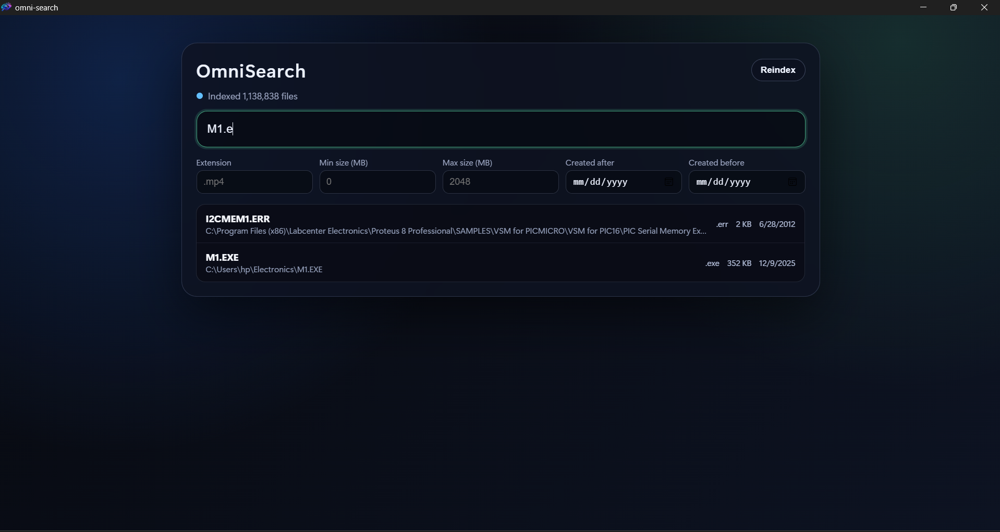

# OmniSearch

High-performance Windows desktop file search built with Tauri v2, Rust, and C++.
OmniSearch indexes NTFS metadata directly through USN/MFT APIs for fast global search with advanced filters.

<p align="center">
  
</p>


## Features

- Native Windows indexing engine in C++ using `DeviceIoControl` + USN/MFT enumeration.
- Rust FFI bridge exposing Tauri commands: `start_indexing`, `index_status`, `search_files`.
- React + TypeScript "Spotlight-style" UI with non-blocking async search.
- Filter support by extension, file size range, and created date range.
- MSI installer output for distribution.
- Windows manifest configured to request Administrator privileges (`requireAdministrator`) for raw volume access.

## Tech Stack

- Frontend: React 19, TypeScript, Vite
- Desktop shell: Tauri v2
- Bridge: Rust (`tauri`, `serde`, `cc`)
- Native engine: C++ (Win32 API, NTFS USN/MFT)
- Installer: WiX/MSI via Tauri bundle

## 📂 Repository Structure

```text
omni-search/
├── src/                         # ⚛️ React & TypeScript UI
│   ├── App.tsx                  # Main Search Interface
│   ├── App.css                  # Custom Styling
│   └── main.tsx                 # Frontend Entry Point
├── public/                      # Static Assets
│   └── app-icon.png             # Frontend Favicon
├── src-tauri/                   # 🦀 Tauri (Rust) Backend
│   ├── cpp/                     # ⚙️ C++ High-Speed Engine
│   │   └── scanner.cpp          # Native NTFS Scanner (MFT Access)
│   ├── src/                     # Rust Source Code
│   │   ├── lib.rs               # FFI Bindings & Tauri Commands
│   │   └── main.rs              # App Entry & Lifecycle
│   ├── build.rs                 # C++ Compilation Script
│   ├── windows-app-manifest.xml # 🛡️ Admin Privileges (For Volume Access)
│   ├── tauri.conf.json          # Application Configuration
│   └── icons/                   # System App Icons
├── docs/                        # 📖 Documentation
│   └── images/                  # Architecture & Screenshots
├── index.html                   # HTML Entry Point
├── package.json                 # Node.js Dependencies
└── README.md                    # Project Documentation
```

## How It Works

1. UI calls Tauri commands from React using `@tauri-apps/api`.
2. Rust command layer forwards calls to C++ through `extern "C"` FFI.
3. C++ scanner reads NTFS metadata via USN/MFT (`DeviceIoControl`).
4. Search results are serialized to JSON and returned to the UI.

## Requirements

- Windows 10/11 (NTFS volume)
- Node.js 20+ and npm
- Rust stable toolchain (`x86_64-pc-windows-msvc`)
- Visual Studio 2022 C++ Build Tools (`Desktop development with C++`)
- WebView2 Runtime (normally preinstalled on Windows 11)

## Quick Start (Development)

```powershell
cd e:\omni-search
npm install
cd src-tauri
cargo check
cd ..
npm run tauri dev
```

Important:

- The app needs Administrator privileges to read `\\.\C:` for USN/MFT data.
- If indexing fails with "Unable to open volume", run the app elevated or use the packaged build with UAC prompt.

## Build Installers (Distribution)

Build MSI:

```powershell
cd e:\omni-search
npx tauri build -b msi
```

Output path:

- `src-tauri/target/release/bundle/msi/omni-search_0.1.0_x64_en-US.msi`

Build EXE installer (NSIS):

```powershell
npx tauri build -b nsis
```

Output path:

- `src-tauri/target/release/bundle/nsis/`

## Customize App Icon / Branding

Generate all required Tauri icons from one square source image:

```powershell
npx tauri icon .\path\to\your-logo-1024.png --output .\src-tauri\icons
```

Update visible app metadata in `src-tauri/tauri.conf.json`:

- `productName`
- `app.windows[0].title`

## Troubleshooting

- `Unable to open volume`:
  - Run as Administrator.
  - Confirm target drive is NTFS: `fsutil fsinfo volumeinfo C:`.
- `cl.exe not found`:
  - Install Visual Studio C++ Build Tools and reopen terminal.
- App still shows old icon:
  - Regenerate icons, run `cargo clean`, rebuild, and restart Explorer (Windows icon cache).


## Contributing

1. Fork the repo.
2. Create a feature branch.
3. Run checks (`cargo check`, `npm run build`).
4. Open a PR with test notes and benchmark notes if scanner logic changed.
