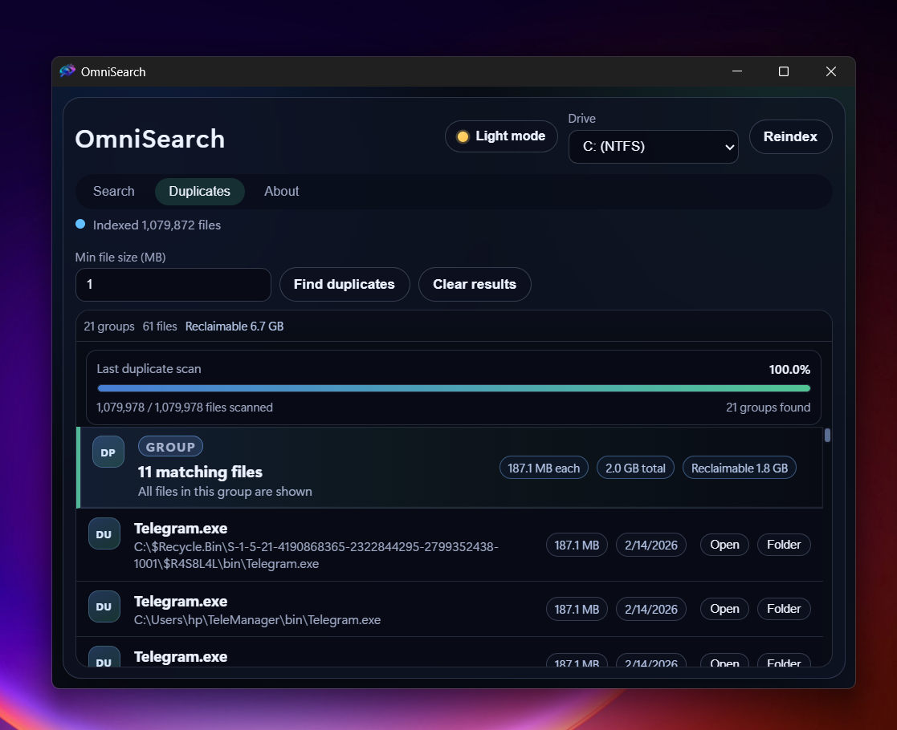

# OmniSearch

High-performance Windows desktop file search built with Tauri v2, Rust, and C++.
OmniSearch indexes NTFS metadata directly through USN/MFT APIs for fast global search with advanced filters and duplicate detection.

<p align="center">
  
</p>

<p align="center"><strong>Search Experience</strong></p>
<p align="center">
  
</p>
<p align="center"><em>Main search tab with filters, categories, previews, and actions.</em></p>
<p align="center"><sub>──────────── · ────────────</sub></p>
<p align="center">&nbsp;</p>

<p align="center"><strong>Duplicate Finder</strong></p>
<p align="center">
  
</p>
<p align="center"><em>Duplicate Finder groups identical files, shows reclaimable space, and supports progress + cancel.</em></p>
<p align="center"><sub>──────────── · ────────────</sub></p>
<p align="center">&nbsp;</p>

<p align="center"><strong>Drive Scope & Advanced Settings</strong></p>
<p align="center">
  
</p>
<p align="center"><em>Optional all-drives indexing, include-folders toggle, and advanced result-limit controls.</em></p>

<p align="center">
  
</p>

## Features

- Native Windows indexing engine in C++ using `DeviceIoControl` + USN/MFT enumeration.
- Live incremental index updates via USN journal watcher after initial scan.
- Rust FFI bridge exposing Tauri commands for indexing, searching, duplicates, drive listing, and file actions.
- Fast search UI with advanced filters: extension, file size range, created date range.
- Duplicate finder with multithreaded hashing and grouped results (plus reclaimable size).
- Duplicate scan controls: live progress %, scanned/total counters, groups found, and cancel support.
- Drive picker with NTFS detection and volume access checks.
- Optional search scope toggle to scan all NTFS drives instead of only the selected drive.
- Optional `Include folders` indexing mode so folder paths can appear in search results.
- Advanced settings panel for configurable default search limit (persisted locally).
- Incremental `Load more` results flow that expands by your configured default limit step.
- Result tools: open file, reveal in folder, previews (image/video/pdf), sort modes, and category tabs.
- Light/dark theme toggle and separate Search / Duplicates / About tabs.
- Installer targets via Tauri bundle (MSI and NSIS).
- Windows manifest requests Administrator privileges (`requireAdministrator`) for raw volume access.

## Tech Stack

- Frontend: React 19, TypeScript, Vite
- Desktop shell: Tauri v2
- Bridge: Rust (`tauri`, `serde`, `cc`)
- Native engine: C++ (Win32 API, NTFS USN/MFT)
- Installer: WiX/MSI and NSIS via Tauri bundle

## Repository Structure

```text
omni-search/
├── src/                         # React & TypeScript UI
│   ├── App.tsx                  # Main Search Interface
│   ├── App.css                  # Custom Styling
│   └── main.tsx                 # Frontend Entry Point
├── public/                      # Static Assets
│   └── app-icon.png             # Frontend Favicon
├── src-tauri/                   # 🦀 Tauri (Rust) Backend
│   ├── cpp/                     # ⚙️ C++ High-Speed Engine
│   │   └── scanner.cpp          # Native NTFS Scanner (MFT Access)
│   ├── src/                     # Rust Source Code
│   │   ├── lib.rs               # FFI Bindings & Tauri Commands
│   │   └── main.rs              # App Entry & Lifecycle
│   ├── build.rs                 # C++ Compilation Script
│   ├── windows-app-manifest.xml # 🛡️ Admin Privileges (For Volume Access)
│   ├── tauri.conf.json          # Application Configuration
│   └── icons/                   # System App Icons
├── docs/                        # Documentation
│   └── images/                  # Architecture & Screenshots
├── index.html                   # HTML Entry Point
├── package.json                 # Node.js Dependencies
└── README.md                    # Project Documentation
```

## How It Works

1. React UI calls Tauri commands using `@tauri-apps/api`.
2. Rust command layer forwards calls to C++ through `extern "C"` FFI.
3. C++ scanner reads NTFS metadata via USN/MFT (`DeviceIoControl`) and builds in-memory index state.
4. Live USN watcher applies file changes after initial indexing to keep search current.
5. Search and duplicate results are serialized to JSON and returned to the UI.

## Main Commands (Tauri)

- `start_indexing`, `index_status`
- `search_files`
- `find_duplicate_groups`, `duplicate_scan_status`, `cancel_duplicate_scan`
- `list_drives`
- `open_file`, `reveal_in_folder`
- `open_external_url`
- `load_preview_data_url`

## Requirements

- Windows 10/11 (NTFS volume)
- Node.js 20+ and npm
- Rust stable toolchain (`x86_64-pc-windows-msvc`)
- Visual Studio 2022 C++ Build Tools (`Desktop development with C++`)
- WebView2 Runtime (normally preinstalled on Windows 11)

## Quick Start (Development)

```powershell
cd e:\omni-search
npm install
cd src-tauri
cargo check
cd ..
npm run tauri dev
```

Important:

- The app needs Administrator privileges to read `\\.\C:` for USN/MFT data.
- If indexing fails with "Unable to open volume", run the app elevated or use the packaged build with UAC prompt.

## Build Installers (Distribution)

Build MSI:

```powershell
cd e:\omni-search
npx tauri build -b msi
```

Output path:

- `src-tauri/target/release/bundle/msi/omni-search_<version>_x64_en-US.msi`

Build EXE installer (NSIS):

```powershell
npx tauri build -b nsis
```

Output path:

- `src-tauri/target/release/bundle/nsis/`

## Customize App Icon / Branding

Generate all required Tauri icons from one square source image:

```powershell
npx tauri icon .\path\to\your-logo-1024.png --output .\src-tauri\icons
```

Update visible app metadata in `src-tauri/tauri.conf.json`:

- `productName`
- `app.windows[0].title`

## Troubleshooting

- `Unable to open volume`:
  - Run as Administrator.
  - Confirm target drive is NTFS: `fsutil fsinfo volumeinfo C:`.
- `cl.exe not found`:
  - Install Visual Studio C++ Build Tools and reopen terminal.
- App still shows old icon:
  - Regenerate icons, run `cargo clean`, rebuild, and restart Explorer (Windows icon cache).

## Contributing

1. Fork the repo.
2. Create a feature branch.
3. Run checks (`cargo check`, `npm run build`).
4. Open a PR with test notes and benchmark notes if scanner logic changed.

## Star History

<a href="https://www.star-history.com/#Eul45/omni-search&type=date&legend=top-left">
 <picture>
   <source media="(prefers-color-scheme: dark)" srcset="https://api.star-history.com/svg?repos=Eul45/omni-search&type=date&theme=dark&legend=top-left" />
   <source media="(prefers-color-scheme: light)" srcset="https://api.star-history.com/svg?repos=Eul45/omni-search&type=date&legend=top-left" />
   
 </picture>
</a>
