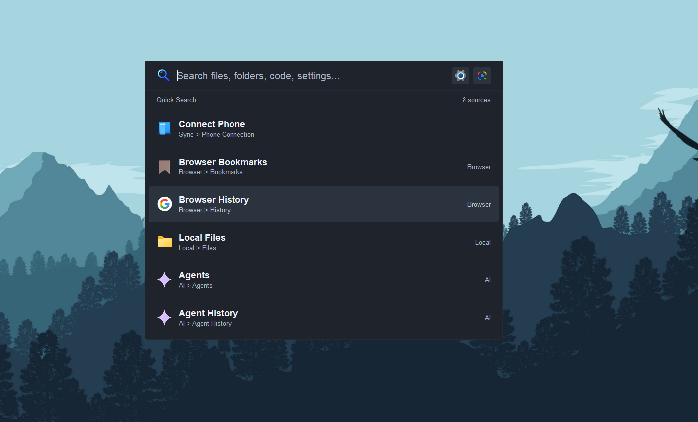

# OmniSearch Lite 

A lightweight, superfast desktop search launcher and productivity suite for Windows built in pure Rust.

<p align="center">
  <a href="https://apps.microsoft.com/detail/9NMZS1GMTCT2">
    
  </a>
</p>

<p align="center">
  <a href="https://apps.microsoft.com/detail/9NMZS1GMTCT2">
    
  </a>
</p>

---

## Key Features

* **Ultra-Fast Local File Search**: Instant search across millions of files, folders, and code files.
* **Circle to Search**: Snip or draw on any part of your screen to trigger instant visual search (Google Lens).
* **Mobile Phone Sync**: Pair your smartphone over local Wi-Fi for bi-directional file transfer.
* **Smart AI Workspace**: Integrated AI assistant workflow for Q&A, flashcard creation, code writing, and document analysis.
* **Browser Integration**: Search Chrome, Firefox, Edge, and Brave history and bookmarks directly from your search bar.
* **Built-in Plugins**: Quick access to Calculator, Color Picker (HEX/RGB), and Text Expansion Snippets.
* **100% Privacy-First**: All indexes and local database content remain stored strictly on your PC.

---

## Build from Source

### Prerequisites
* Rust stable toolchain
* Inno Setup 6 (for creating Windows installer)

### Build Command
```bash
cargo build --release
```

To build the Inno Setup installer executable:
```bash
iscc installer.iss
```
Output setup executable will be generated at `setup/omnisearchlitesetup.exe`.

---

## License

MIT License © 2026 Eyuel Engida.
